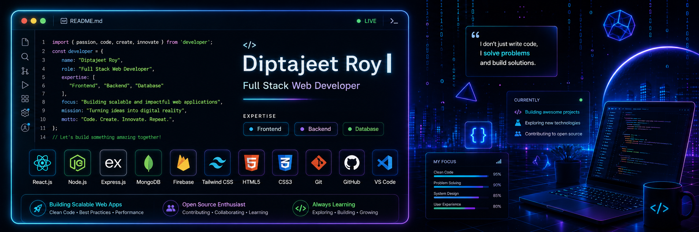

<p align="center">
  
</p>

<h1 align="center">Diptajeet Roy</h1>

<p align="center">
  Full Stack Developer • MERN Stack Enthusiast • ICE Student at NSTU
</p>

<p align="center">
  Building modern, scalable, and user-focused web applications with clean architecture and responsive UI.
</p>

<p align="center">
  <a href="https://github.com/diptajeet25">
    
  </a>

  <a href="https://linkedin.com/in/diptajeet-roy">
    
  </a>

  <a href="mailto:diptajeet345@gmail.com">
    
  </a>
</p>

---

# Developer Profile

```js
const dipta = {
  role: "Full Stack Developer",

  university: "Noakhali Science and Technology University",

  currentlyLearning: [
    "Next.js",
    "System Design",
    "Modern Frontend Architecture"
  ],

  workingOn: [
    "Tax Payment Platform",
    "Scalable MERN Applications"
  ],

  technologies: {
    frontend: [
      "React.js",
      "Tailwind CSS",
      "JavaScript"
    ],

    backend: [
      "Node.js",
      "Express.js"
    ],

    database: [
      "MongoDB"
    ],

    tools: [
      "Git",
      "GitHub",
      "Firebase",
      "VS Code"
    ]
  }
};
```

---

# Tech Stack

<p align="left">
  
</p>

---

# Featured Projects

## Tax Payment Platform

Modern taxation platform with authentication, dashboards, payment workflow, and responsive user experience.

### Tech Used

- React.js
- Node.js
- Express.js
- MongoDB
- Firebase

### Features

- Secure Authentication
- Dynamic Dashboard
- Payment Management
- Responsive Design

---

## MERN Stack Applications

Full stack applications focused on clean UI, scalable backend architecture, and performance optimization.

### Focus Areas

- Authentication Systems
- REST APIs
- Responsive Frontend
- Modern UI/UX
- Database Integration

---

# Currently Building

- Scalable MERN stack applications
- Modern React architecture
- Advanced frontend workflows
- Clean and reusable UI systems
- Performance-focused web experiences

---

# GitHub Analytics

<p align="center">
  

  
</p>

<p align="center">
  
</p>

---

# Contribution Activity

<p align="center">
  
</p>

---

# Development Philosophy

```txt
Clean code.
Modern architecture.
Meaningful user experience.
Continuous learning.
```

---

# Connect With Me

<p align="left">
  <a href="mailto:diptajeet345@gmail.com">
    
  </a>

  <a href="https://linkedin.com/in/diptajeet-roy">
    
  </a>
</p>

---

<p align="center">
  Open to collaboration, innovative projects, and development opportunities.
</p>
